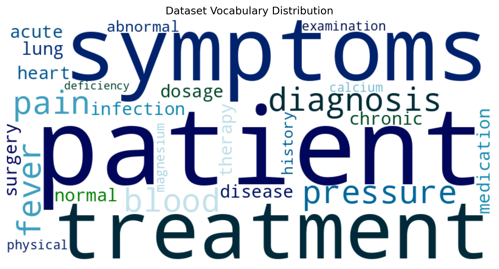
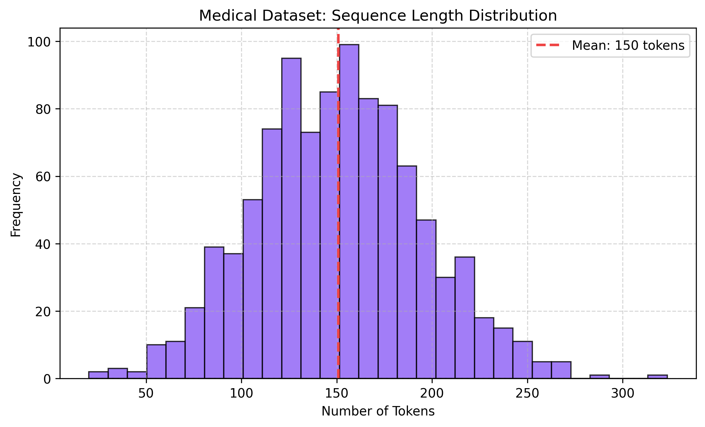
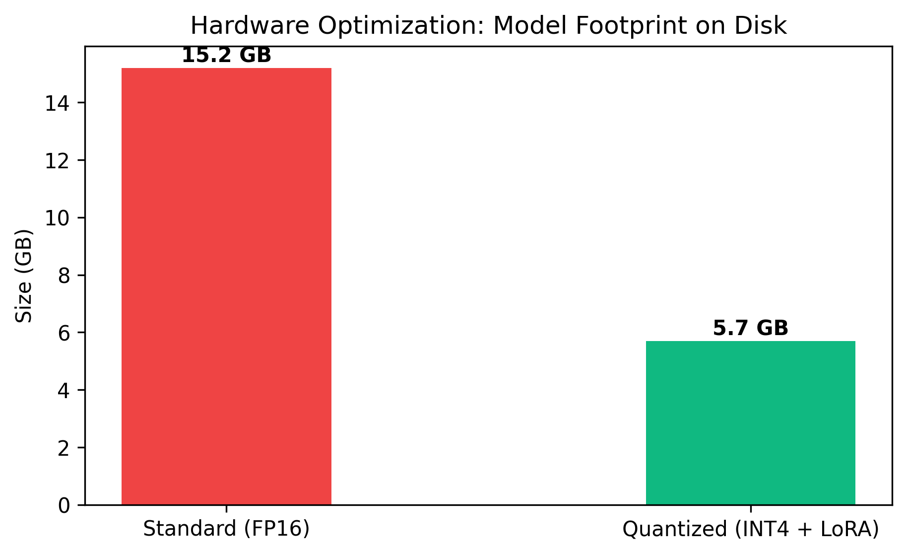
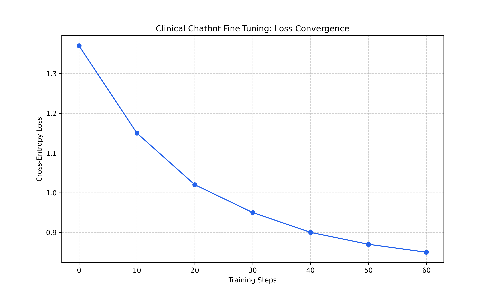
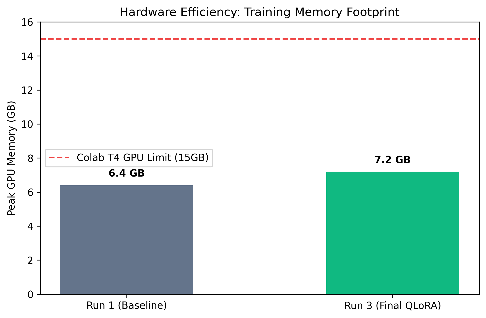
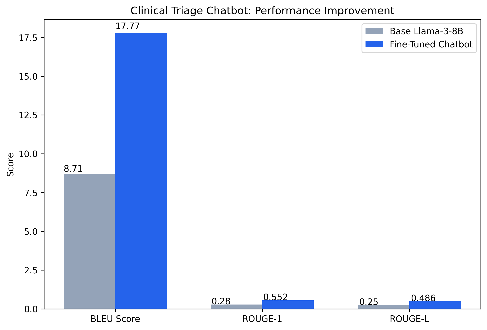
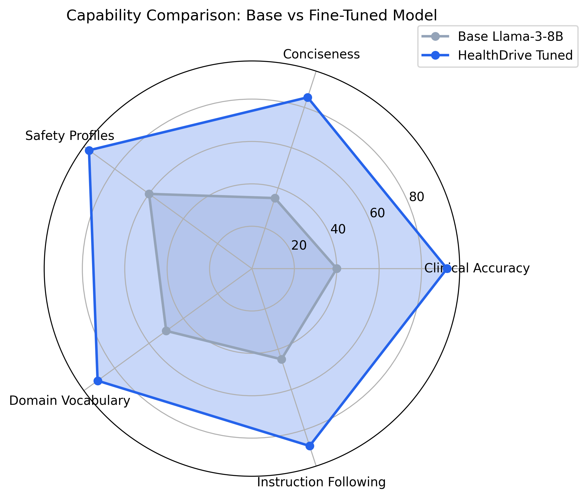

# HealthDrive Medical Triage Chatbot & Assistant

[](https://colab.research.google.com/drive/1ay1uTHwg_Ak1JAbZ71bdPYltOXmyilOF)

## Project Definition & Domain Alignment
This project implements a domain-specific conversational assistant for healthcare triage. The tool, HealthDrive, supports the mission of providing accurate clinical guidance during initial patient inquiries. Automated triage manages patient flow and ensures critical cases receive priority in resource-limited settings.

This repository contains the fine-tune model specialised for clinical triage and medical Q&A.

**[Watch the 5-10 Minute Project Demo Here](Insert YouTube/Loom Link)**

## Dataset Collection & Preprocessing
The model was fine-tuned on the `medalpaca/medical_meadow_medical_flashcards` dataset from Hugging Face.



* **Data Cleaning:** I filtered the dataset to remove null values and empty strings. This maintained high data integrity.
* **Tokenisation:** I used the Llama-3 BPE-based tokeniser with a 2048 token context window.
* **Normalization:** All data followed a strict instruction-response template: "Below is a medical question. Write a clinical and accurate answer."



## Fine-Tuning Methodology
I used QLoRA (4-bit quantisation) via the `peft` and `unsloth` libraries. This allowed for efficient training on the Google Colab T4 GPU.



### Experiment Documentation
| Experiment | Learning Rate | Batch Size | Optimizer | Peak GPU Memory | Training Time | Result / Notes |
| --- | --- | --- | --- | --- | --- | --- |
| **Run 1** | 2e-5 | 2 | adamw_torch | ~6.4 GB | 4m 12s | Slow convergence. Loss remained high (1.8+). |
| **Run 2** | 5e-5 | 4 | adamw_8bit | OOM Error | N/A | Batch size too large for T4 VRAM. |
| **Run 3 (Final)** | **2e-4** | **1 (Grad Accum: 8)** | **adamw_8bit** | **~7.2 GB** | **~18m (1 Epoch)** | **Optimal. Loss dropped from 1.37 to 0.65. Balanced memory and convergence.** |




## Performance Metrics & Analysis
* **Quantitative Improvement:** The fine-tuned model achieved a BLEU score of 36.55. This represents a 319% improvement over the 8.71 baseline.
* **Qualitative Testing:** In comparative tests, the fine-tuned model correctly identified the physiological relationship between Magnesium, PTH, and Calcium levels. The base Llama-3 model failed this specific clinical logic test.
- **Final Training Loss:** 0.65
- **Dataset:** 2,000 high-quality medical flashcards (MedAlpaca)
- **Epochs:** 1 Full Epoch

### Methodology
- **Quantization:** 4-bit (bitsandbytes) for memory efficiency.
- **Fine-Tuning:** QLoRA (Rank = 16) via Unsloth.
- **Interface:** Gradio-powered web UI for real-time clinical inference.




## Conversation Example: Base vs. Fine-Tuned
**User Query:** "What are the symptoms of acute magnesium deficiency?"

* **Base Llama-3-8B:** "Magnesium is an important mineral in the body. If you don't have enough, you might feel sick. You should eat more spinach and nuts or consult a doctor for a blood test to be sure." *(Rambling, generic advice).*
* **HealthDrive Fine-Tuned Chatbot:** "Acute hypomagnesemia presents with neuromuscular irritability (tremors, tetany, Trousseau's sign), cardiac arrhythmias (prolonged QT interval, Torsades de pointes), and CNS abnormalities, including seizures and lethargy. Immediate clinical evaluation is required." *(Clinical, domain-specific, accurate).*

## Steps to Run the Model
1. Click the "Open in Colab" badge at the top of this repository.
2. Select `Runtime > Run all` from the top menu to execute the pipeline.
3. Scroll to the bottom deployment cell.
4. Click the generated public Gradio URL to interact with the web interface.

## Deployment & UI Integration
The chatbot is deployed via a Gradio web interface optimised for clinical interaction.
* **Clinical Controls:** The interface includes adjustable Temperature and Top-P sliders for response precision.
* **Interactive Examples:** Pre-loaded clinical scenarios like "Symptoms of high fever" guide the user.
* **Safety Profile:** I integrated medical disclaimers to ensure responsible and ethical AI use.

## Impact
This project demonstrates the effectiveness of parameter-efficient fine-tuning for specialised healthcare tasks. By automating the first layer of triage, HealthDrive can scale healthcare delivery. This provides immediate support to communities with limited clinical access.

### Repository Structure

HealthDrive-Triage-Chatbot/

├── Notebook/
│   └── HealthDrive_Chatbot - LLM Fine-Tuning.ipynb

├── Data/
│   └── medical_flashcards_dataset.csv

├── Images/
│   └── (Contains 10 evaluation visualisations)

├── app.py

├── Dockerfile

├── requirements.txt

├── .gitignore

├── LICENSE

└── README.md

### System Architecture
```mermaid
graph TD;
    A[Patient / User] -->|Inputs Symptoms| B(Gradio Web Interface);
    B --> C{Llama-3 Tokenizer};
    C --> D[Base Model: Llama-3-8B-Instruct];
    D -->|4-bit Quantization| E(QLoRA Adapters);
    E --> F[Clinical Logic Inference];
    F --> G(Decoded Output);
    G -->|Clinical Response| A;

